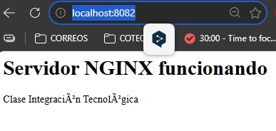
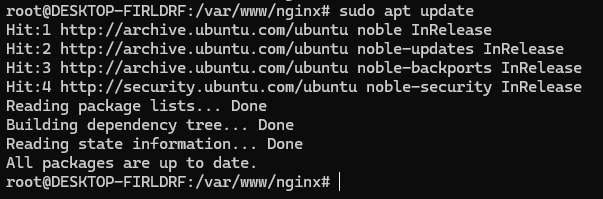
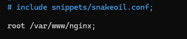
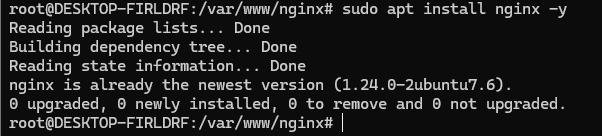

• ¿Qué es Apache?
Apache es un servidor web de codigo abierto y gratuito, que se
utiliza par aalojar y gestionar sitios web en internet.
• ¿Qué es NGINX?
Nginx es un servidor web, proxy inverso y balanceador de carga open 
source que soporta a millones de paginas web en todo el mundo.
• Diferencias
Apache:
-Amplia comunidad y soporte.
-Gran cantidad de módulos (autenticación, reescritura de URLs, etc.).
-Ideal para proyectos que requieren compatibilidad con aplicaciones antiguas
Nginx:
-Maneja mejor el tráfico masivo.
-Perfecto para servir contenido estático (imágenes, videos, archivos).
-Funciona muy bien como reverse proxy y balanceador de carga.
• ¿Cuándo usar cada uno?
Apache cuando:
-Necesitas compatibilidad amplia con aplicaciones antiguas, CMS (WordPress, Drupal, Joomla) o proyectos que dependen de .htaccess.
-Requieres configuración muy personalizada gracias a sus módulos (autenticación, reescritura de URLs, etc.).
-El tráfico es moderado y no necesitas manejar miles de conexiones simultáneas.
-Buscas facilidad de uso y documentación extensa para principiantes.
Nginx cuando:
-Tu sitio debe manejar alto tráfico con eficiencia (miles de conexiones concurrentes).
-Servirás mucho contenido estático (imágenes, videos, archivos).
-Necesitas un proxy inverso o balanceador de carga para distribuir tráfico entre varios servidores.
-Quieres bajo consumo de recursos y máxima velocidad.

